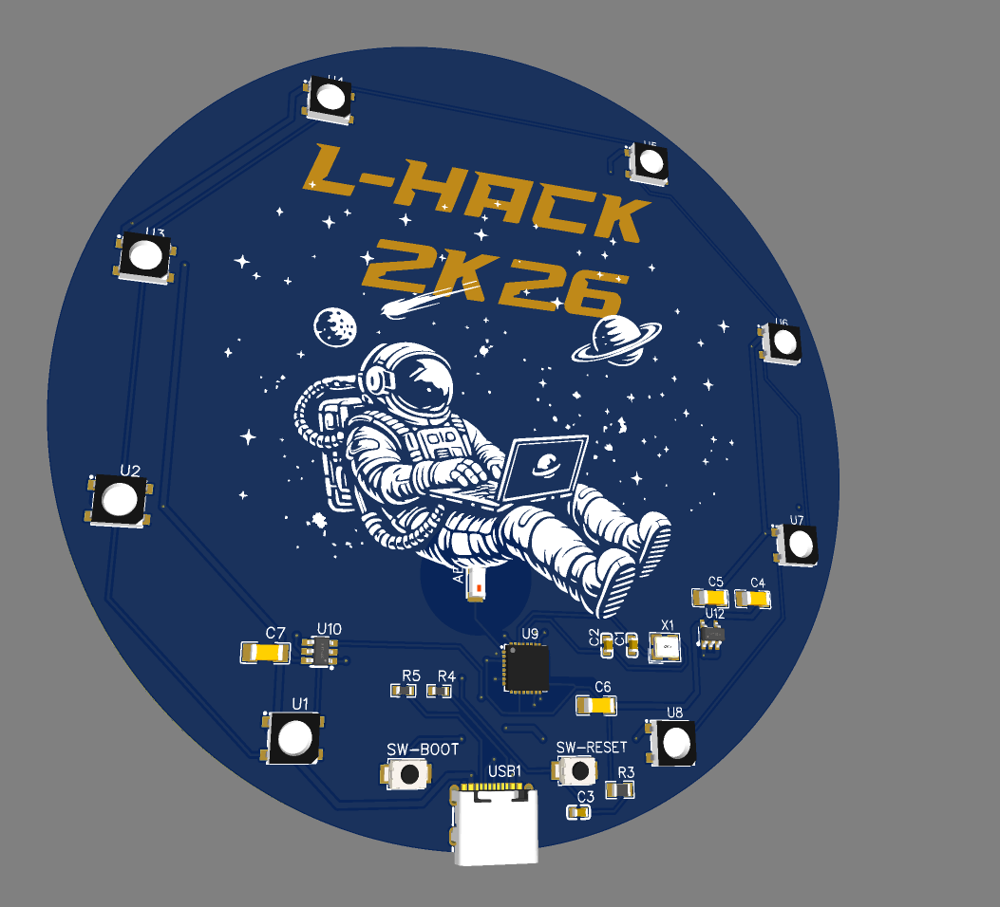
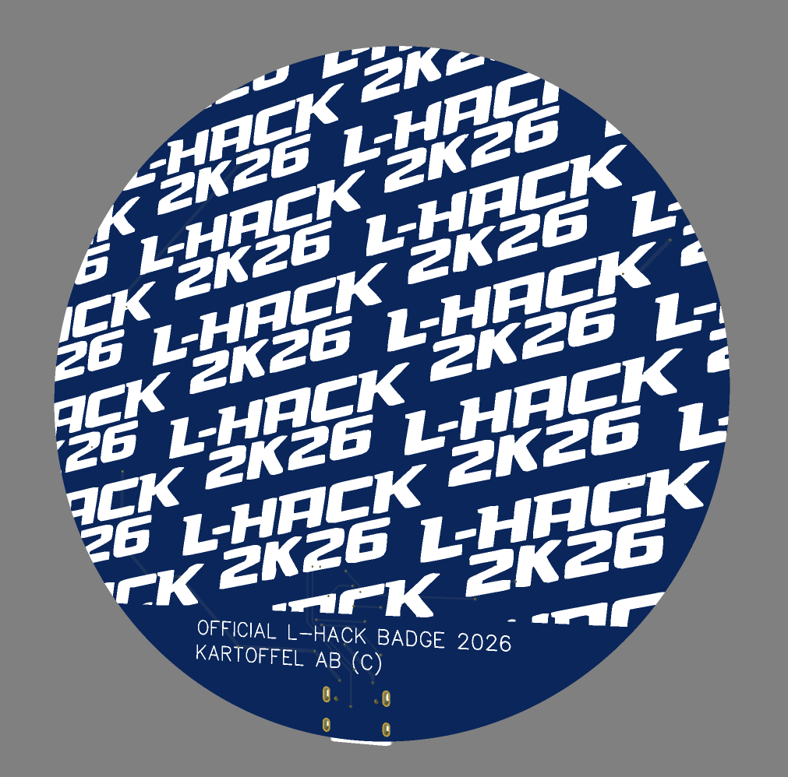

# LHACK 2k26 Badge

Official repo for the LHACK Badge 2026

It consists of a ESP32-C3 and RGB-LEDS.

* ESP32-C3 [https://www.digikey.se/en/products/detail/espressif-systems/ESP32-C3FH4X/24366489](https://www.digikey.se/en/products/detail/espressif-systems/ESP32-C3FH4X/24366489)
* RGB Leds (Pin 10): [https://www.lcsc.com/product-detail/C26167850.html](https://www.lcsc.com/product-detail/C26167850.html)

HW Design inspired from: [https://www.waveshare.com/wiki/ESP32-C3-Zero#Hardware_Description](https://www.waveshare.com/wiki/ESP32-C3-Zero#Hardware_Description)

## Getting started with arduino 

1. Install board: esp32 by Espressif Systems
2. Select board: Waveshare EPS32-S3-Zero

